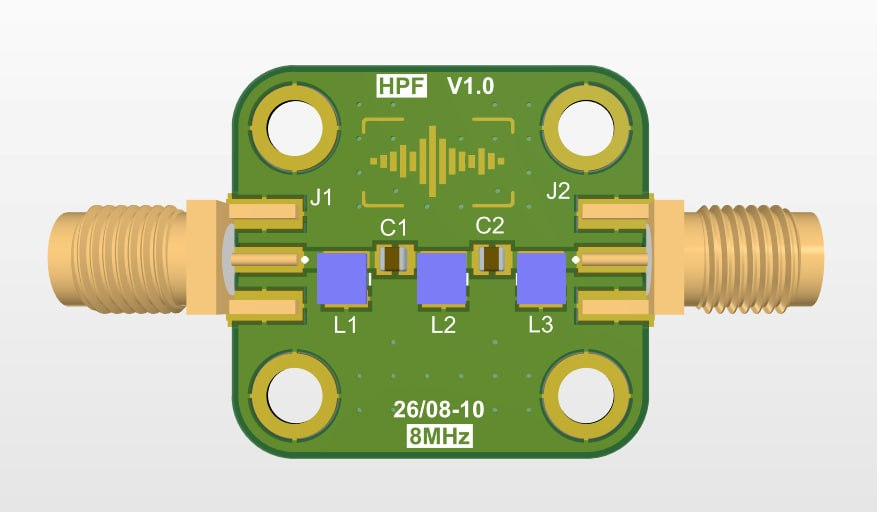

# HPF V1.0 - 8MHz High-Pass Filter

## Overview
This repository contains the design files and fabrication details for the **HPF V1.0**, a compact passive High-Pass Filter PCB. It is designed to attenuate frequencies below 8MHz, making it ideal for RF signal conditioning and noise reduction applications.

## Specifications
* **Type:** High-Pass Filter (HPF)
* **Cutoff Frequency:** 8 MHz
* **Filter Topology:** LC passive network (L1, L2, L3 / C1, C2)
* **I/O Connectors:** 2x SMA Edge-Launch (J1, J2)
* **Hardware:** 4x Mounting holes

## Fabrication Notes
When sending this board for fabrication, standard FR4 material is typically sufficient for an 8MHz cutoff. Ensure you provide the Gerber files and specify the desired board thickness (usually 1.6mm for standard SMA edge connectors) to your man

## Features
Simple to use.
## License

mealadmmb@gmail.com

**Free To use. enjoy**

